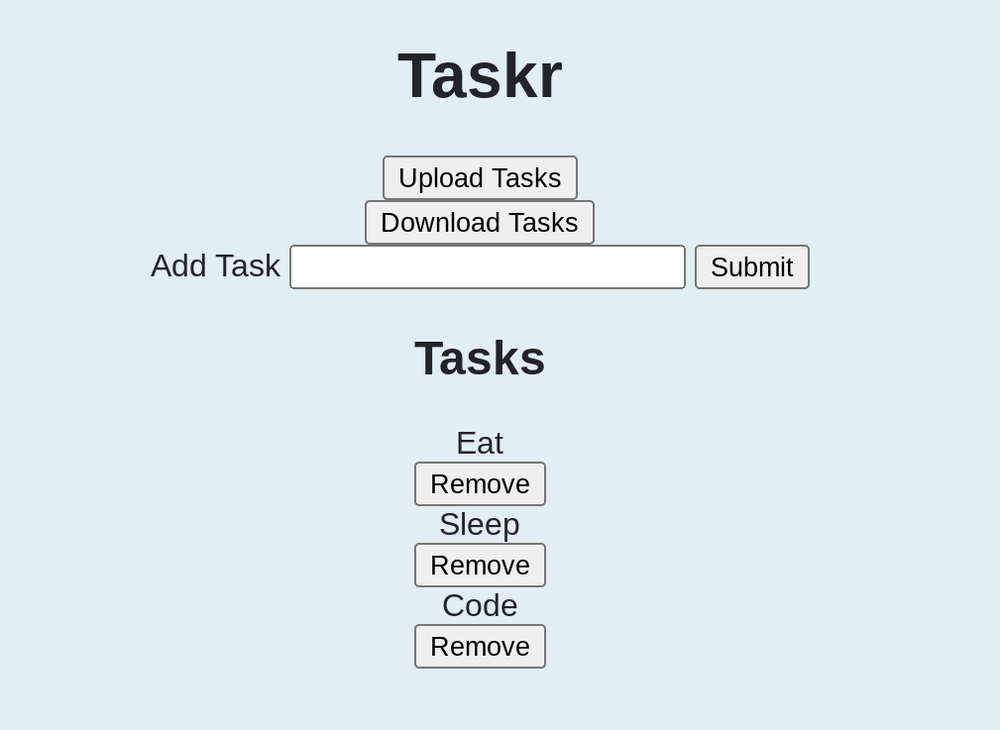

# Taskr
A task management web app.

# Technologies
It was built with Vanilla JavaScript, the DOM API and HTML/CSS.

It uses JSON to store tasks.

# Features
So far a user can add tasks and they will be saved in the client's browser storage.